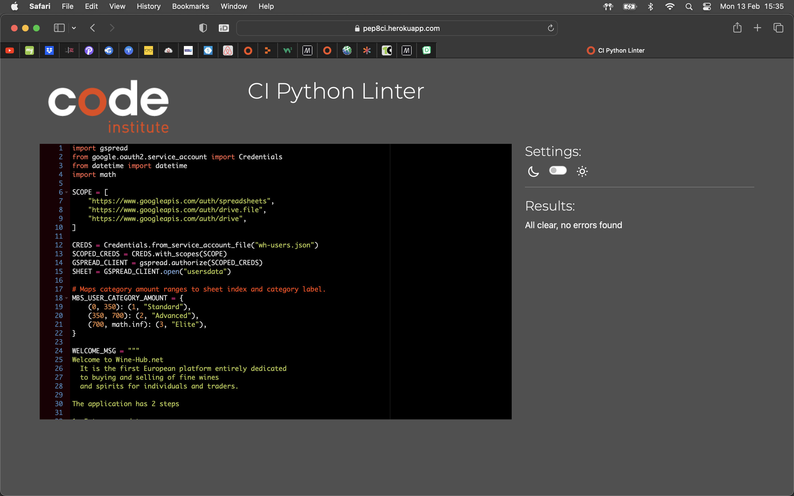

# Wine-Hub
### It is the first European platform entirely dedicated to buying and selling of fine wines and spirits for individuals and traders.

* The file that contains my code is called `wh.py`
* The spreadsheet that is connected to is called `usersdata`
* The application has two steps:
    - Enter your data.
    - Calculate the best membership (MBS) plan for you
    which can be:
   - `Standard` for small businesses.
   - `Advance` for medium businesses.
   - `Elite` for wine brokers and large businesses.

## Creating the Heroku app

When you create the app, you will need to add two buildpacks from the _Settings_ tab. The ordering is as follows:

1. `heroku/python`
2. `heroku/nodejs`

You must then create a _Config Var_ called `PORT`. Set this to `8000`

If you have credentials, such as in the Love Sandwiches project, you must create another _Config Var_ called `CREDS` and paste the JSON into the value field.

Connect your GitHub repository and deploy as normal.

## Testing

I have manually tested this proiect by doing the following

 • Daccod the rode throuch a DED& lintor and confirmed there ore no problem.

• Given invalid inouts: strinas when numbers are expected out of bounds inouts. same inbut twice
Tested in my local terminal and the Code Institute Heroku terminal.

## Bugs

- When I started the project I had some issue to make the python format, adding to much space through the function and loop, then I realised that issus and fix it removing the extra spaces.

- My validation for the function calculate_mbs_usr_amount were wrong becuse I couldn’t not be able to extrac the data that it was needed.

    
       The way i resolved my issue was just adding the
        `(data[0], data[3])`
        to the terminal and it worked.

## Validator Testing
  - PEP8
      -  No errors were returned from PEPSonline com

      